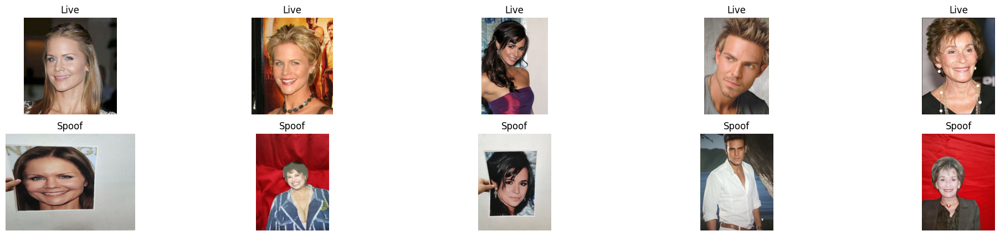

# Liveness Detection System

Prototype of a liveness detection system to identify spoofs in videos from camera selfies. The project includes training, evaluation, inference and adversarial attack generation to test and improve the liveness detection model.



**>>> Please see the comprehensive project report for a complete explanation of this project (link below) <<<**

## Table of Contents

- **[Comprehensive project report](./Report.md)**
- [Installation](#installation)
- [Usage](#usage)
- [Disclaimer](#disclaimer)

## Installation

### Using Conda

1. Clone the repository:
    ```sh
    git clone https://github.com/andreluizbvs/liveness_system.git
    cd liveness_system
    ```

2. Create and activate the Conda environment:
    ```sh
    conda env create -f environment.yml
    conda activate liveness
    ```
    or

    ```sh
    conda create -n liveness python=3.12
    pip install -r requirements.txt
    conda install -c conda-forge libstdcxx-ng
    conda activate liveness
    ```

## Usage

1. Prepare model weights and datasets. Place datasets in the `data/` folder, and the weights in the `ckpt/` folder, both at this project's root directory:

    - [Required] Download the datasets [here](https://drive.google.com/file/d/1YhO77mX-lrsHrylAGhwAJr86ZX4CD4IG/view?usp=sharing). Extract the zip contents in the `data/` folder. 
    
        Obs.: It is **not necessary** getting the whole CelebA-Spoof dataset. It is very big (77 GB), but if you need it, go [here](https://www.kaggle.com/datasets/attentionlayer241/celeba-spoof-for-face-antispoofing);
    
    - [Required] Download the pretrained models [here](https://drive.google.com/file/d/1sQFPC9IyQFFDmKX28_uD4mgN00dtZSiL/view?usp=sharing).

2. Run the liveness inference script to see the system working on an image or a video. See an example below:
    ```sh
    cd src/
    ```
    ```sh
    python liveness_inference.py ../data/celebA-spoof_samples/CelebA_Spoof_/CelebA_Spoof/Data/test/3613/spoof/541354.png 2>/dev/null
    ```
    You can pass images and videos paths here.
    Obs.: The "`2>/dev/null`" is just to supress warnings. Remove if you wish to see it.

3. **[Recommended]** Experiment with the three provided jupyter notebooks. There are already some pre-loaded results and some sample input images:
    - `src/tools/adversarial_attack_manipulation.ipynb`
    - `src/tools/liveness_predict.ipynb`
    - `src/tools/liveness_output_analysis.ipynb`
    
    They are quite intuitive. More info on them, please check out the [project report](./Report.md).

4. To train one of the two models (SiliconeMaskModel or FaceDepthModel) run the train script to train and evaluate the liveness detection model. Here are two examples:
    ```sh
    python train.py --data_path ../data/silicone_faces --model_name silicone
    ```
    or
    ```sh
    python train.py --data_path ../data/celebA-spoof --model_name depth
    ```
    Both will output the accuracy, precision, recall, and F1-score of the model. Also, it will automatically fine-tune the chosen model after its training session on adversarial attack augmented data. The data will be genrerated automatically and passed to the model. In the end, a comparison between the model's performance with and without fine-tuning against the adversarial attack data will be shown.

5. To evaluate the models in the CelebA-Spoof Test set, simply run the following:
    ```sh
    python evaluate.py
    ```


## Disclaimer

This project is provided "as is" without any warranties of any kind, either express or implied. Use at your own risk.